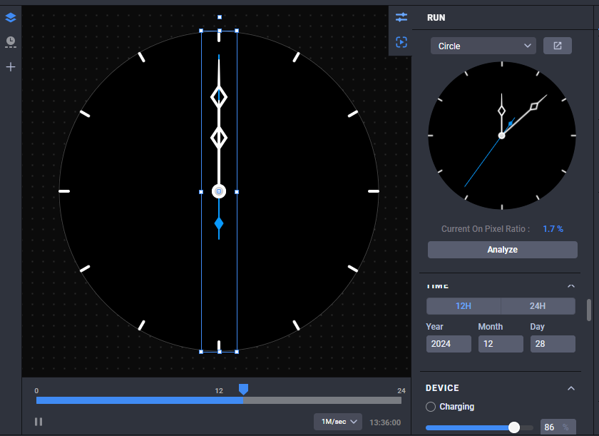
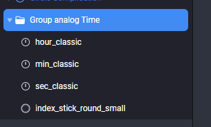
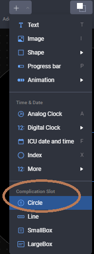
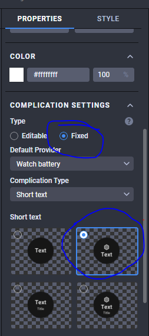
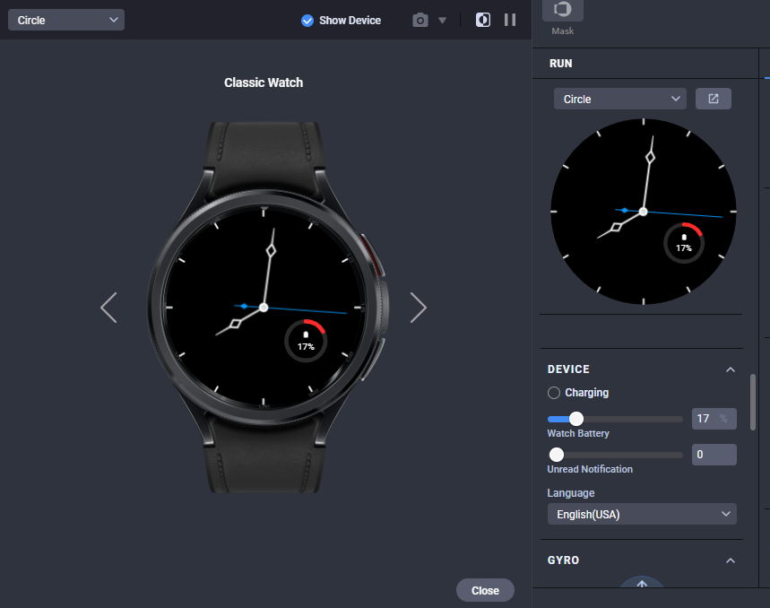

<!---->

# create an Analog Watch Face using Watch Hand, Index and Tag Expressions

### 1. Objective

---

Learn how to create a watch face that responds based on the battery level using Tag Expressions in Watch Face Studio.

### 2. Start project

---

1. Click on New Project to start a new project.

2. A blank studio will show upon creating new project.

### 3. Add analog hands and index

To create index you can choose a design from Time & Date -> Index -> resources folder.
And for analog hands Time a& Date -> More -> resources folder.

After adding index and analog hands.

Select all the newly added components and click Group. Rename the group as **Group Analog Time**.

### 4. Add Battery Level

1.  Add a circular progress bar and rename the component as Battery Level.
2.  Drag the Background slider to 0%.
3.  Go to Value properties. Replace the value with 0 and, in Tags, input or choose [BATT_PER] to use the current battery percentage as the value.
4.  Add a Circle Complication Slot and rename it as **Battery Icon**. Complications are a set of components that can be handled as one group.
5.  Set the Type to Fixed and change the Default Provider to Watch battery.
6.  Select Short text as Complication Type and choose Icon + Text for layout.

### 5. Make use of tag expressions

1.  Duplicate the circular progress bars named battery level and renamed as background.
2.  Change component’s color to #FFFFFF or white.
3.  Duplicate this and rename it as color change.Move it behind background.
4.  Drag the Background slider to 16% and remove tag in the Value properties
5.  Change Color Change color to #FF001E or red.
6.  Change color will serve as gap fillers of each progress bar.

##### Change the color of the Battery Level to red if the battery level is equal to or less than 20%

1.  Select Battery Level and navigate to Color properties.
2.  Check if the color opacity value is 100. This will serve as the base value.
3.  In Tags, input [BATT_PER]<=20?-100:0 to subtract 100 from the base value of opacity if the battery level is equal to or less than 20. Otherwise, the base opacity value remains the same.
4.  In the Run pane, adjust the Device > Watch Battery to 20% or less, and you will see how the color will change to red.

